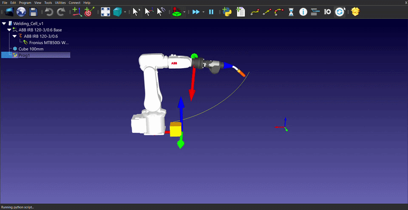

# Zrobotyzowane Stanowisko Spawalnicze (RoboDK & Python)

Projekt symulacji zrobotyzowanego stanowiska spawalniczego z wykorzystaniem robota przemysłowego marki **ABB**, zrealizowany w środowisku offline programming - **RoboDK**. Projekt łączy symulację kinematyki z zaawansowaną logiką sterującą napisaną w języku Python.

## ⚙️ Główne funkcje i logika programu
Projekt nie jest tylko prostą animacją ścieżki, ale zawiera zaimplementowane algorytmy sterujące i bezpieczeństwa:
* **Dynamiczna zmiana prędkości:** Robot automatycznie spowalnia ruch na czas wykonywania właściwego procesu spawania detalu (klocka), a po jego zakończeniu wraca do optymalnej prędkości przejazdowej.
* **Aktywna detekcja kolizji:** W przypadku wykrycia kolizji, program natychmiast generuje alert i zatrzymuje ruch ramienia, zapobiegając uszkodzeniom.

## 🛠️ Wykorzystane technologie
* **Środowisko:** RoboDK
* **Język programowania:** Python (RoboDK API)
* **Sprzęt docelowy:** Robot przemysłowy ABB

## 📂 Zawartość repozytorium
* `Welding_Cell.rdk` - Plik stacji roboczej RoboDK zawierający środowisko 3D, kinematykę robota ABB, narzędzie spawalnicze oraz detal.
* `Welding_Cell.py` - Skrypt sterujący logiką robota (obsługa prędkości procesu spawania oraz algorytm wykrywania kolizji i zatrzymania awaryjnego).
